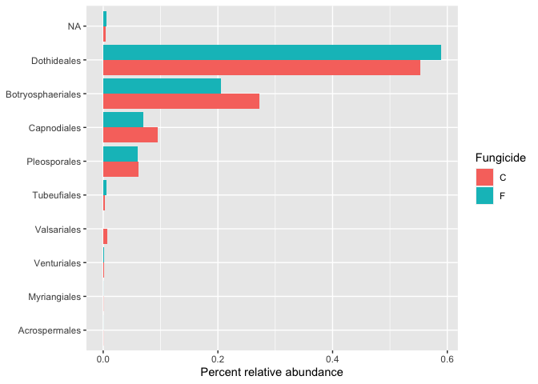

```r
library(tidyverse)
```

```
## ── Attaching packages ─────────────────────────────────────── tidyverse 1.3.2 ──
## ✔ ggplot2 3.4.1     ✔ purrr   1.0.1
## ✔ tibble  3.1.8     ✔ dplyr   1.1.0
## ✔ tidyr   1.3.0     ✔ stringr 1.5.0
## ✔ readr   2.1.4     ✔ forcats 1.0.0
## ── Conflicts ────────────────────────────────────────── tidyverse_conflicts() ──
## ✖ dplyr::filter() masks stats::filter()
## ✖ dplyr::lag()    masks stats::lag()
```


```r
datum <- read.csv("../Assign_4_data_wrangling/data/Microbiome.csv")

str(datum)
```

```
## 'data.frame':	1353422 obs. of  42 variables:
##  $ X                   : int  1242826 1320150 794589 1242688 1320170 1243099 1319917 1242871 1243075 1242973 ...
##  $ OTU                 : chr  "FOTU_7" "FOTU_9" "FOTU_44" "FOTU_7" ...
##  $ Sample              : chr  "Corn2017RootObjective2Collection2T2R5BFE1" "Corn2017RootObjective2Collection1T1R1ACD10" "Corn2017RootObjective2Collection1T1R2BFC12" "Corn2017RootObjective2Collection2T2R6BFB4" ...
##  $ Abundance           : num  0.997 0.996 0.993 0.989 0.984 ...
##  $ SampleID            : chr  "Corn2017RootObjective2Collection2T2R5BFE1" "Corn2017RootObjective2Collection1T1R1ACD10" "Corn2017RootObjective2Collection1T1R2BFC12" "Corn2017RootObjective2Collection2T2R6BFB4" ...
##  $ BarcodeSequence     : chr  "ATCGTCCGCG" "CAACGTGCTC" "CCTGTCCTAT" "ACTGCTATCG" ...
##  $ LinkerPrimerSequence: chr  "CAAGCAGAAGACGGCATACGAGAT" "CAAGCAGAAGACGGCATACGAGAT" "CAAGCAGAAGACGGCATACGAGAT" "CAAGCAGAAGACGGCATACGAGAT" ...
##  $ Region              : chr  "ITS" "ITS" "ITS" "ITS" ...
##  $ BC_plate            : int  1 3 3 1 3 1 3 3 3 1 ...
##  $ BC_name             : chr  "PCR_R_bc5" "PCR_R_bc268" "PCR_R_bc283" "PCR_R_bc26" ...
##  $ Crop                : chr  "Corn" "Corn" "Corn" "Corn" ...
##  $ Objective           : chr  "Objective 2" "Objective 2" "Objective 2" "Objective 2" ...
##  $ Collection          : int  2 1 1 2 2 2 2 2 2 2 ...
##  $ Compartment         : chr  "Root" "Root" "Root" "Root" ...
##  $ DateSampled         : chr  "5-Jul-17" "26-Jun-17" "26-Jun-17" "5-Jul-17" ...
##  $ GrowthStage         : chr  "V8" "V6" "V6" "V8" ...
##  $ Treatment           : chr  "T2" "T1" "T1" "T2" ...
##  $ Rep                 : chr  "R5" "R1" "R2" "R6" ...
##  $ sample_Sample       : chr  "B" "A" "B" "B" ...
##  $ Fungicide           : chr  "F" "C" "F" "F" ...
##  $ Target_organism     : chr  "Fungi" "Fungi" "Fungi" "Fungi" ...
##  $ Location            : chr  "Kellogg Biological Station" "Kellogg Biological Station" "Kellogg Biological Station" "Kellogg Biological Station" ...
##  $ Experiment          : chr  "LTER" "LTER" "LTER" "LTER" ...
##  $ Year                : int  2017 2017 2017 2017 2017 2017 2017 2017 2017 2017 ...
##  $ Phi2                : logi  NA NA NA NA NA NA ...
##  $ PhiNO               : logi  NA NA NA NA NA NA ...
##  $ PhiNPQ              : logi  NA NA NA NA NA NA ...
##  $ Relative.Chlorophyll: logi  NA NA NA NA NA NA ...
##  $ Sample_or_Control   : chr  "True Sample" "True Sample" "True Sample" "True Sample" ...
##  $ is.neg              : logi  FALSE FALSE FALSE FALSE FALSE FALSE ...
##  $ OTU_ID              : chr  "FOTU_7" "FOTU_9" "FOTU_44" "FOTU_7" ...
##  $ Kingdom             : chr  "Fungi" "Fungi" "Fungi" "Fungi" ...
##  $ Phylum              : chr  "Ascomycota" "Ascomycota" "Ascomycota" "Ascomycota" ...
##  $ Class               : chr  "Sordariomycetes" "Dothideomycetes" "Dothideomycetes" "Sordariomycetes" ...
##  $ Order               : chr  "Sordariales" "Pleosporales" "Pleosporales" "Sordariales" ...
##  $ Family              : chr  "Chaetomiaceae" "Didymellaceae" "Sporormiaceae" "Chaetomiaceae" ...
##  $ Genus               : chr  NA "Didymella" "Preussia" NA ...
##  $ Species             : chr  NA "Didymella sp." "Preussia sp." NA ...
##  $ Isolate             : chr  NA NA NA NA ...
##  $ Isolate_percent_id  : num  0 0 0 0 0 0 0 0 0 0 ...
##  $ BestMatch           : chr  "Chaetomiaceae" "Didymella sp." "Preussia sp." "Chaetomiaceae" ...
##  $ Taxonomy            : chr  "FOTU_7-Chaetomiaceae" "FOTU_9-Didymella sp." "FOTU_44-Preussia sp." "FOTU_7-Chaetomiaceae" ...
```


Q1. Select the following columns.


```r
datum %>% 
  select(c(OTU, SampleID, Abundance, Crop, Compartment, DateSampled, GrowthStage, Treatment, Rep, Fungicide, Kingdom, Phylum, Class, Order, Family, Genus, Species, Taxonomy))
```


Q2. Calculate the mean percent relative abundance across all OTUs by compartment using the pipe operator.


```r
datum %>% 
  group_by(Compartment) %>% 
  summarize(Abundance = mean(Abundance))
```

```
## # A tibble: 2 × 2
##   Compartment Abundance
##   <chr>           <dbl>
## 1 Leaf         0.000409
## 2 Root         0.000409
```


Q3. Calculate the mean percent relative abundance across all OTUs by compartment and fungicide using the pipe operator.


```r
datum %>% 
  group_by(Compartment, Fungicide) %>% 
  summarize(Abundance = 100*mean(Abundance))
```

```
## `summarise()` has grouped output by 'Compartment'. You can override using the
## `.groups` argument.
```

```
## # A tibble: 4 × 3
## # Groups:   Compartment [2]
##   Compartment Fungicide Abundance
##   <chr>       <chr>         <dbl>
## 1 Leaf        C            0.0409
## 2 Leaf        F            0.0409
## 3 Root        C            0.0409
## 4 Root        F            0.0409
```

Q4. Restrict the previous analysis to just the fungal class Dothideomycetes.


```r
datum %>% 
  filter(Class == "Dothideomycetes") %>% 
  group_by(Compartment, Fungicide) %>% 
  summarize(Abundance = 100*mean(Abundance))
```

```
## `summarise()` has grouped output by 'Compartment'. You can override using the
## `.groups` argument.
```

```
## # A tibble: 4 × 3
## # Groups:   Compartment [2]
##   Compartment Fungicide Abundance
##   <chr>       <chr>         <dbl>
## 1 Leaf        C            0.0940
## 2 Leaf        F            0.0910
## 3 Root        C            0.0365
## 4 Root        F            0.0298
```

Q5. Now do the same analysis but for Orders in the class Dothideomycetes.


```r
datum %>% 
  filter(Class == "Dothideomycetes") %>% 
  group_by(Order, Compartment, Fungicide) %>% 
  summarize(Abundance.m = 100*mean(Abundance))
```

```
## `summarise()` has grouped output by 'Order', 'Compartment'. You can override
## using the `.groups` argument.
```

```
## # A tibble: 40 × 4
## # Groups:   Order, Compartment [20]
##    Order             Compartment Fungicide Abundance.m
##    <chr>             <chr>       <chr>           <dbl>
##  1 Acrospermales     Leaf        C           0.000241 
##  2 Acrospermales     Leaf        F           0.0000414
##  3 Acrospermales     Root        C           0.000213 
##  4 Acrospermales     Root        F           0.000118 
##  5 Botryosphaeriales Leaf        C           0.0102   
##  6 Botryosphaeriales Leaf        F           0.0191   
##  7 Botryosphaeriales Root        C           0.550    
##  8 Botryosphaeriales Root        F           0.407    
##  9 Capnodiales       Leaf        C           0.175    
## 10 Capnodiales       Leaf        F           0.132    
## # … with 30 more rows
```

Q6. Calculate the standard error for each mean in Q5.


```r
df <- datum %>% 
  filter(Class == "Dothideomycetes") %>% 
  group_by(Order, Compartment, Fungicide) %>% 
  summarize(Abundance.m = 100*mean(Abundance), 
            n=n(),
            se = sd(Abundance)/sqrt(n)
            )
```

```
## `summarise()` has grouped output by 'Order', 'Compartment'. You can override
## using the `.groups` argument.
```


Q7. Select the columns Order, Compartment, Fungicide and Mean from the output of Q6 and Pivot the dataset to wide format so you have Compartment as column headers


```r
df <- df %>% 
  select(Order, Compartment, Fungicide, Abundance.m)

df %>% 
  pivot_wider(names_from = c(Compartment), values_from = Abundance.m)
```

```
## # A tibble: 20 × 4
## # Groups:   Order [10]
##    Order             Fungicide      Leaf      Root
##    <chr>             <chr>         <dbl>     <dbl>
##  1 Acrospermales     C         0.000241  0.000213 
##  2 Acrospermales     F         0.0000414 0.000118 
##  3 Botryosphaeriales C         0.0102    0.550    
##  4 Botryosphaeriales F         0.0191    0.407    
##  5 Capnodiales       C         0.175     0.00973  
##  6 Capnodiales       F         0.132     0.00377  
##  7 Dothideales       C         0.994     0.0855   
##  8 Dothideales       F         1.06      0.0710   
##  9 Myriangiales      C         0.000548  0.0000567
## 10 Myriangiales      F         0.000254  0        
## 11 Pleosporales      C         0.0842    0.0367   
## 12 Pleosporales      F         0.0860    0.0309   
## 13 Tubeufiales       C         0.000591  0.00401  
## 14 Tubeufiales       F         0.00720   0.00366  
## 15 Valsariales       C         0.0145    0.0000478
## 16 Valsariales       F         0         0        
## 17 Venturiales       C         0.000967  0.00192  
## 18 Venturiales       F         0.00160   0.000243 
## 19 <NA>              C         0.00542   0.00226  
## 20 <NA>              F         0.00527   0.00607
```


Q8. Recreate this plot using your dataset in Q7. 


```r
order <- datum %>% 
  filter(Class == "Dothideomycetes") %>%
  group_by(Order) %>% 
  summarize(Abundance.m = 100*mean(Abundance)) %>% 
  arrange(Abundance.m) %>% 
  select(Order)

order <- order$Order

plotdatum <- datum %>% 
  filter(Class == "Dothideomycetes") %>%
  group_by(Order, Fungicide) %>% 
  summarize(Abundance.m = 100*mean(Abundance))
```

```
## `summarise()` has grouped output by 'Order'. You can override using the
## `.groups` argument.
```

```r
plotdatum$Order <- factor(plotdatum$Order, levels=order)
```


```r
plotdatum %>% 
  ggplot(aes(x=Order, y = Abundance.m, fill = Fungicide)) +
  geom_col(position = "dodge") +
  xlab(NULL) +
  ylab("Percent relative abundance") +
  coord_flip()
```

<!-- -->
