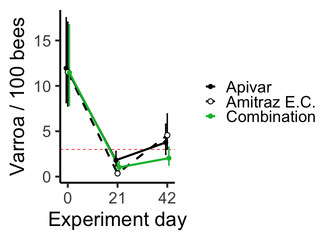
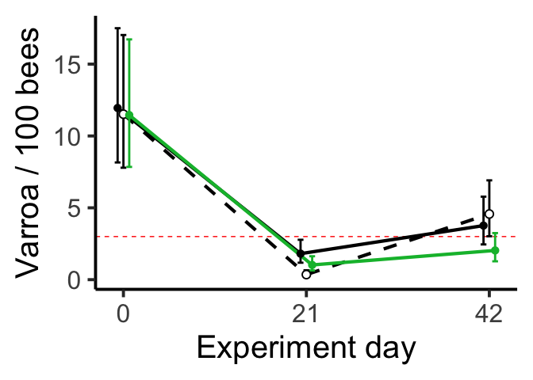

# Question 1

*Background*

* Varroa mites are bad for honey bee colonies. 
* To determine whether Varroa mites are at damaging levels, we take a sample of 1/2 cup of bees and count the number of mites in those samples.
* Several treatments are used in the industry:
  * Apivar (amitraz-based, registered, acts slowly)
  * Amitraz E.C. (amitraz-based, not registered for use in bees, reputed to act quickly and effectively)
  * Apiguard (thymol-based, registered, acts quickly)

*Data*

* For simplicity, I'm going to look at just one response variable for this assignment: The number of Varroa mites per sample of ~300 bees.


*Tested treatments*

* Apivar (Standard treatment)
* Combination of Apivar & Apiguard (Test treatment)
* Amitraz E.C. (Positive control, this is the one beekeepers say works the best)

*Experimental design*

* Colonies in the same apiary assigned to receive the different treatments
* Repeated-measures design
* Varroa infestation rate measured for each colony on Day 0 (Day of treatment), on Day 21, and Day 42

*Objectives*

* Determine whether a Combination treatment can control Varroa more effectively than Apivar on its own
* Determine whether a Combination treatment can control Varroa as effectively as Amitraz E.C.
* Determine whether Apivar is more or less effective against Varroa than Amitraz E.C.

*Hypotheses*

* A Combination treatment can control Varroa more effectively than Apivar on its own
* A Combination treatment can control Varroa as effectively as Amitraz E.C.
* Apivar is less effective than Amitraz E.C.

*Statistical plan to test hypotheses*

* Consider experiment day and treatment as categorical explanatory variables (allows for nonlinear response of Varroa through time)
* I previously found evidence of overdispersion when modeling the data as Poisson, so we'll use a negative binomial model instead
* Since it's a repeated measures design (each colony measured thrice), we'll include a random effect of Colony ID
* Since we have a pre-post design, we're not looking for a treatment effect, statistically speaking (this would mean that a difference between treatments existed on Day 0 and all other days). What we're actually asking is... is there an interaction between Day and Treatment?
* We'll report an overall ANOVA P-value for the Day-Treatment interaction
* Since there was a significant Day-Treatment interaction, we will use emmeans() to compare the treatments within each day.
* Using Emmeans, we will do a pairwise contrast (post-hoc tes) within each day; therefore, three comparisons are made within Day 0 (and for Day 21 and 42); therefore, there will be multiplicity adjustment for three comparisons. Emmeans by default uses the Tukey's Honestly Significant Differences adjustment.

# Question 2
See code below


```r
library(tidyverse)
```

```
## ── Attaching packages ─────────────────────────────────────── tidyverse 1.3.2 ──
## ✔ ggplot2 3.4.1     ✔ purrr   1.0.1
## ✔ tibble  3.1.8     ✔ dplyr   1.1.0
## ✔ tidyr   1.3.0     ✔ stringr 1.5.0
## ✔ readr   2.1.4     ✔ forcats 1.0.0
## ── Conflicts ────────────────────────────────────────── tidyverse_conflicts() ──
## ✖ dplyr::filter() masks stats::filter()
## ✖ dplyr::lag()    masks stats::lag()
```

```r
library(lme4)
```

```
## Loading required package: Matrix
## 
## Attaching package: 'Matrix'
## 
## The following objects are masked from 'package:tidyr':
## 
##     expand, pack, unpack
```

```r
library(emmeans)
```

Read data

```r
datum <- read.csv("datum_simplified.csv")
```

Set variables as factors

```r
datum$trt <- factor(datum$trt , levels=c("Apivar", "AEC", "Apiguard_Api"))
datum$days <- factor(datum$days)
```


Fit model and null model

```r
tempdatum <- datum %>% filter(
  days != "10"
) # Because we did not measure mite infestation of adult bees on Day 10

# "model of phoretic mite number per sample fit with negative binomial family to account for count data with overdispersion"
m.phor.nb1 <- glmer.nb(mites_recov_total ~ 
                     trt + 
                     days + 
                     trt:days + 
                     (1 | col_no), 
                   data = tempdatum)
summary(m.phor.nb1)
```

```
## Generalized linear mixed model fit by maximum likelihood (Laplace
##   Approximation) [glmerMod]
##  Family: Negative Binomial(2.2619)  ( log )
## Formula: mites_recov_total ~ trt + days + trt:days + (1 | col_no)
##    Data: tempdatum
## 
##      AIC      BIC   logLik deviance df.resid 
##    935.2    967.2   -456.6    913.2      125 
## 
## Scaled residuals: 
##     Min      1Q  Median      3Q     Max 
## -1.3711 -0.7662 -0.2786  0.3724  3.0780 
## 
## Random effects:
##  Groups Name        Variance Std.Dev.
##  col_no (Intercept) 0.1003   0.3167  
## Number of obs: 136, groups:  col_no, 47
## 
## Fixed effects:
##                        Estimate Std. Error z value Pr(>|z|)    
## (Intercept)             3.57908    0.19473  18.380  < 2e-16 ***
## trtAEC                 -0.03673    0.27755  -0.132 0.894703    
## trtApiguard_Api        -0.04216    0.27154  -0.155 0.876630    
## days21                 -1.88734    0.26681  -7.074 1.51e-12 ***
## days42                 -1.15507    0.26955  -4.285 1.83e-05 ***
## trtAEC:days21          -1.59489    0.44131  -3.614 0.000301 ***
## trtApiguard_Api:days21 -0.52652    0.38654  -1.362 0.173157    
## trtAEC:days42           0.23057    0.37893   0.608 0.542874    
## trtApiguard_Api:days42 -0.57269    0.39065  -1.466 0.142648    
## ---
## Signif. codes:  0 '***' 0.001 '**' 0.01 '*' 0.05 '.' 0.1 ' ' 1
## 
## Correlation of Fixed Effects:
##             (Intr) trtAEC trtA_A days21 days42 tAEC:2 tA_A:2 tAEC:4
## trtAEC      -0.695                                                 
## trtApgrd_Ap -0.704  0.494                                          
## days21      -0.591  0.417  0.429                                   
## days42      -0.598  0.421  0.431  0.440                            
## trtAEC:dy21  0.365 -0.527 -0.259 -0.602 -0.265                     
## trtApg_A:21  0.413 -0.290 -0.585 -0.689 -0.303  0.416              
## trtAEC:dy42  0.437 -0.623 -0.307 -0.309 -0.710  0.398  0.216       
## trtApg_A:42  0.416 -0.291 -0.586 -0.303 -0.690  0.183  0.412  0.491
```

```r
isREML(m.phor.nb1) # glmer.nb models are always fit by log-likelihood
```

```
## [1] FALSE
```

Test significance of interaction

```r
# Fit model that omits trt:days interaction
m.phor.nb0 <- glmer.nb(mites_recov_total ~ 
                     trt + 
                     days + 
                     # trt:days + 
                     (1 | col_no), 
                   data = tempdatum)
summary(m.phor.nb0)
```

```
## Generalized linear mixed model fit by maximum likelihood (Laplace
##   Approximation) [glmerMod]
##  Family: Negative Binomial(1.764)  ( log )
## Formula: mites_recov_total ~ trt + days + (1 | col_no)
##    Data: tempdatum
## 
##      AIC      BIC   logLik deviance df.resid 
##    949.8    970.2   -467.9    935.8      129 
## 
## Scaled residuals: 
##     Min      1Q  Median      3Q     Max 
## -1.2477 -0.6993 -0.2997  0.4364  4.6242 
## 
## Random effects:
##  Groups Name        Variance Std.Dev.
##  col_no (Intercept) 0.05906  0.243   
## Number of obs: 136, groups:  col_no, 47
## 
## Fixed effects:
##                 Estimate Std. Error z value Pr(>|z|)    
## (Intercept)       3.8038     0.1718  22.145  < 2e-16 ***
## trtAEC           -0.3009     0.1994  -1.509   0.1313    
## trtApiguard_Api  -0.3718     0.1981  -1.877   0.0605 .  
## days21           -2.4259     0.1826 -13.282  < 2e-16 ***
## days42           -1.1994     0.1756  -6.831 8.43e-12 ***
## ---
## Signif. codes:  0 '***' 0.001 '**' 0.01 '*' 0.05 '.' 0.1 ' ' 1
## 
## Correlation of Fixed Effects:
##             (Intr) trtAEC trtA_A days21
## trtAEC      -0.594                     
## trtApgrd_Ap -0.618  0.487              
## days21      -0.490  0.145  0.092       
## days42      -0.430 -0.059  0.083  0.422
```

```r
anova(m.phor.nb0, m.phor.nb1) # There was a significant interaction between day and treatment (p=0.0001481) when tested by ANOVA. Therefore we analyzed each date separately.
```

```
## Data: tempdatum
## Models:
## m.phor.nb0: mites_recov_total ~ trt + days + (1 | col_no)
## m.phor.nb1: mites_recov_total ~ trt + days + trt:days + (1 | col_no)
##            npar    AIC    BIC  logLik deviance Chisq Df Pr(>Chisq)    
## m.phor.nb0    7 949.83 970.22 -467.92   935.83                        
## m.phor.nb1   11 935.17 967.21 -456.59   913.17 22.66  4  0.0001481 ***
## ---
## Signif. codes:  0 '***' 0.001 '**' 0.01 '*' 0.05 '.' 0.1 ' ' 1
```


Emmeans saved to an object to send to ggplot for plotting

```r
emplot_phor <- emmip(m.phor.nb1, trt~days, type = "response", CIs = TRUE, plotit = FALSE)
emplot_phor$days <- as.numeric(as.character(emplot_phor$days))
emplot_phor$trt <- factor(emplot_phor$trt, levels = c("Apivar", "AEC", "Apiguard_Api"))
levels(emplot_phor$trt) # check order of factors
```

```
## [1] "Apivar"       "AEC"          "Apiguard_Api"
```

Make plot

```
## Warning: Using `size` aesthetic for lines was deprecated in ggplot2 3.4.0.
## ℹ Please use `linewidth` instead.
```

<!-- --><!-- -->

Emmeans to make statistical comparisons between treatments within day
P-values and estimates of effect size ("times as many Varroa per sample") come from here.

```r
emmeans(m.phor.nb1, pairwise ~ trt | days, type = "response")$contrasts
```

```
## days = 0:
##  contrast              ratio    SE  df null z.ratio p.value
##  Apivar / AEC          1.037 0.288 Inf    1   0.132  0.9904
##  Apivar / Apiguard_Api 1.043 0.283 Inf    1   0.155  0.9868
##  AEC / Apiguard_Api    1.005 0.278 Inf    1   0.020  0.9998
## 
## days = 21:
##  contrast              ratio    SE  df null z.ratio p.value
##  Apivar / AEC          5.112 1.930 Inf    1   4.321  <.0001
##  Apivar / Apiguard_Api 1.766 0.560 Inf    1   1.794  0.1714
##  AEC / Apiguard_Api    0.345 0.134 Inf    1  -2.736  0.0171
## 
## days = 42:
##  contrast              ratio    SE  df null z.ratio p.value
##  Apivar / AEC          0.824 0.246 Inf    1  -0.648  0.7935
##  Apivar / Apiguard_Api 1.849 0.591 Inf    1   1.925  0.1315
##  AEC / Apiguard_Api    2.245 0.703 Inf    1   2.583  0.0265
## 
## P value adjustment: tukey method for comparing a family of 3 estimates 
## Tests are performed on the log scale
```

```r
confint(emmeans(m.phor.nb1, pairwise ~ trt | days, type = "response"))$contrasts
```

```
## days = 0:
##  contrast              ratio    SE  df asymp.LCL asymp.UCL
##  Apivar / AEC          1.037 0.288 Inf     0.541     1.988
##  Apivar / Apiguard_Api 1.043 0.283 Inf     0.552     1.971
##  AEC / Apiguard_Api    1.005 0.278 Inf     0.526     1.922
## 
## days = 21:
##  contrast              ratio    SE  df asymp.LCL asymp.UCL
##  Apivar / AEC          5.112 1.930 Inf     2.110    12.387
##  Apivar / Apiguard_Api 1.766 0.560 Inf     0.840     3.712
##  AEC / Apiguard_Api    0.345 0.134 Inf     0.139     0.859
## 
## days = 42:
##  contrast              ratio    SE  df asymp.LCL asymp.UCL
##  Apivar / AEC          0.824 0.246 Inf     0.409     1.661
##  Apivar / Apiguard_Api 1.849 0.591 Inf     0.875     3.909
##  AEC / Apiguard_Api    2.245 0.703 Inf     1.078     4.676
## 
## Confidence level used: 0.95 
## Conf-level adjustment: tukey method for comparing a family of 3 estimates 
## Intervals are back-transformed from the log scale
```

# Question 3

Based on the output above, I would make interpretations like the following:

* On Day-0, we did not observe significant differences between any treatment groups.
* On Day-21, Apivar colonies had 5.1 (2.1-12.4; 95%C.I.) times as many Varroa mites as Amitraz E.C. colonies (p<0.001).

