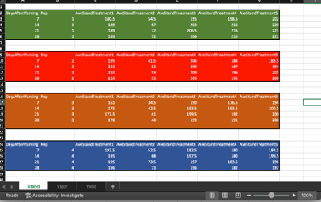

```{r}
library(tidyverse)
```


## Question 1. 

You are looking at a collaborator’s R code on github, and download the repository, and start exploring the code. The first line of the script is 

setwd(“C:/Users/…”)

-	What is the author of this code trying to do with the function setwd()?
-	Please discuss what is wrong with this approach in terms of reproducibility.
-	Where is the working directory of an R project?
-	Explain the concept of relative file paths. Is the author of this code using relative file paths? 

### Answer to Q1

Your collaborator is setting the working directory in terms of an absolute file path. Note that to set an absolute file path you starts all the way down at C:/ the root directory of the Windows hard drive. This would be reproducible on their machine, but not when I copy the R script to a directory on my own machine, since the absolute file path is not the same. An R Project solves this by letting you set relative file paths. When you open a script through an R Project, the working directory sets to the directory that the R Project is located in. You can now specify relative file paths - file paths relative to the working directory. For example, you can have a data folder containing a csv within the working directory and then just refer to read.csv("data/file.csv"). The original author may be setting the working directory (using an absolute file path) in order to then use relative file paths, but we don't know this from the prompt.


## Question 2. 

What does the acronym FAIR stand for in the context of this class? Explain how R, GitHub, and other lecture concepts introduced in this course specifically help complete FAIR data principles. 

### Answer to Q2

This stands for Findable, Accessible, Interpretable, Reusable 

Doing analyses and graphing in R makes sure that the workflow is documented (Reusable) - when compared to a point-and-click interface. If the code is well commented, this also can explain which sections of code generated individual findings (Interpretable). GitHub lets you host code and data online (Findable, Accessible). If you add a DOI to your GitHub repository, this lets you link to the code from a publication of your own and even lets other people cite your data and code directly (Findable, Accessible). Using formats such as Markdown allows people to view your code and outputs in context without even having to download your code (Accessible, Interpretable). GitHub is a backup for your code, which is valuable. Finally, if people want to access your whole repository, GitHub lets them pull a version of the repository onto their own computers so they can recreate your work (Reusable).


## Question 3. 

Explain the concept of R packages. What are R packages? Who writes R packages? What is the difference between installing and loading a package? Explain two ways to install and load packages into R. 

### Answer to Q3

Packages are collections of R functions that someone else has written, that are available to download. Anyone can write an R package, but depending on where they are hosted they probably have to comply with some standards. For example, R packages are supposed to include help files. They may also include datasets and vignettes to show you how to use the package. You usually download R packages from CRAN, a network of servers that hosts R packages. When you use install.packages() this downloads them to your computer. When you use library(), this loads the packages into memory, making all the functions available to use during an R session. You can alternatively install a package in the "Packages" pane of RStudio by pressing "Install"; once a package is installed you can load a package by pointing and clicking to check the checkbox for that package.


## Question 4. 

Explain the following concepts of ggplot and give examples of each concept using code and figures generated with ggplot using the data of your choosing.

-	Layering
-	Scales
-	Themes
-	Facets


### Answer to Q4

Layering is the idea that a plot is built up from individual layers that either render something on top of the previous layers - or modifies other layers. For example, adding geom_point() to a boxplot adds a new scatterplot layer on top of the boxplot, 

```{r}
df <- mtcars
df$cyl <- as.factor(df$cyl)

df %>% 
  ggplot(aes(x = disp, y = mpg)) +
  geom_point() +
  geom_smooth() # Added layer
```


Once you specify that the color aesthetic is mapped to (say) the number of cylinders in an engine, you can use scales to specify HOW that mapping occurs. For example, you can set the levels of colour to correspond to the levels of a categorical value as below, or you can use scale_continuous_manual() to set endpoints of colour to line up with specific values of a continuous variable.

```{r}

df %>% 
  ggplot(aes(x = disp, y = mpg, color = cyl)) +
  geom_point() +
  scale_discrete_manual(values = c("red", "yellow", "grey"), aesthetics = "color") # Manually added a bad choice of color

```


Themes modify aspects of the plotting in general. For example, adding theme_classic() modifies the axes and plot background to be more minimalistic. Within theme() you can also set other global aspects of the plot, like font size.

```{r}
df %>% 
  ggplot(aes(x = disp, y = mpg, color = cyl)) +
  geom_point() +
  theme_bw()

```

Facetting generates several similar graphs - just that each graph is a subset of the data. For example, if you facet by cylinder count using facet_wrap(~cyl) ggplot makes a separate subplot for each number of cylinders

```{r}
df %>% 
  ggplot(aes(x = disp, y = mpg, color = cyl)) +
  geom_point() +
  theme_bw() +
  facet_wrap(~cyl, scales = "free")

```


## Question 5. 

Explain the differences and similarities between a vector, matrix, and dataframe. Demonstrate you know how to subset a dataframe in two ways using the built in dataset ‘ToothGrowth’ with the prompts below:  

-	Subset ToothGrowth to include rows such that supp is equal to VC
-	Subset ToothGrowth to include rows such that supp is equal to VC and dose is equal to 0.5
-	Subset ToothGrowth to include the values of len such that supp is equal to VC and dose is equal to 0.5

### Answer to Q5

A vector is  a one-dimensional set of items. Matrices and dataframes are two-dimensional sets of items (i.e., they have both rows and columns). All the items in a matrix have to be of the same class (e.g., numeric), while a dataframe can have different classes.

```{r}
tooth <- ToothGrowth

# Classic subsetting
tooth[tooth$supp=="VC",]
tooth[tooth$supp=="VC" & tooth$dose==0.5,]
tooth[tooth$supp=="VC" & tooth$dose==0.5,1]


# Subsetting using dplyr verbs
tooth %>% 
  filter(supp=="VC")

tooth %>% 
  filter(supp=="VC", dose==0.5)

tooth %>% 
  filter(supp=="VC", dose==0.5) %>% 
  select(len)

```


## Question 6. 

Create an R markdown version of your answer to question 4 and 5. Save the .Rmd file to your computer and render it as a word document (.docx), .html, and a .md file. Push these files to your github and paste your github url here. 

### Answer to Q6

I have made this whole assignment in a version-controlled repository. These files are up my Github: https://github.com/DanAurell/ENTM6820/tree/main/Midterm_1


## Question 7. 

What is the correct order of events to get your code on github through R studio? Explain each step from creation of a repository to pushing. 

### Answer to Q7
Assuming you've already linked your RStudio to your GitHub account (a bit complicated)...

1) Create a repository ("repo") on the GitHub website.
2) Copy the web address of the GitHub repo (with .git at the end) by pressing the green "Code" button on the GitHub repo page 
3) In RStudio, make a New Project (select "Version Control" option) which checks out the project from a version control repository
  - This will "clone" the repository which means that the contents of the GitHub repo (e.g., the Readme) will be downloaded into your local folder
  - In addition, this creates an R Project in your local folder
4) Make some changes locally: For example, make a new R Markdown document
5) Then in the Git pane of RStudio, check the boxes by the file names whose changes you want to push
6) You press "commit" to somehow stage/package these changes and type in a description of the changes when prompted
7) Then you press "push" to update the GitHub repository to reflect your local changes


## Question 8. 

After you have worked on a project for a while, you mistakenly delete a file on your github, while it still exists in your local repository (on your computer). Now when you try to push your code to github the push is rejected and gives the following error, “Updates were rejected because the remote contains work that you do not have locally.” How do you solve this error?

### Answer to Q8

First, you pull from GitHub so that your local folder contains all the files on GitHub. Then you should be able to push to GitHub.

## Question 9. 

Explain the purpose of a Data Management Plan. 

### Answer to Q9

The purpose of a data management plan is to codify the process of generating, managing, using, and archiving data during a research project. This lets you think through the automated, but most importantly, the manual processes that are potentially prone to errors or concerns about the integrity of the data. Some risks include editing data and no longer having access to something you know is the original dataset; losing data through computer failure; losing access to the data through password issues or expiry of institution credentials; etc. By writing a plan you can decide how to mitigate these risks. 


## Question 10. 

A colleague gives you data in an .xlsx file that looks like this: 



Please discuss at least five things wrong with how these data are formatted that make it not reproducibility friendly. Then describe/show your colleague how the data should be formatted. 

### Answer to Q10

1) "Stand", "Vigor", and "Yield" are variables that should be in separate columns in a single worksheet

2) "Treatment" is a variable and should be a column header, with values of 1-5

3) "Rep" is a variable and should have its own column with values of 1-5 and the reps should not be separated with whitespace and new column headers between.

4) Color is unnecessary

5) You could include the raw data for "Stand" rather than the per (rep-and-treatment) average. This implies that there are also several measurements for each rep and treatment

Here is a simulated dataset that would follow [tidy data](https://r4ds.had.co.nz/tidy-data.html) principles:

```{r}
data.frame(
  Rep = c(rep(1, 60), rep(2, 60), rep(3, 60), rep(4, 60), rep(5, 60)),
  Treatment = rep(c(rep(1, 12),rep(2, 12),rep(3, 12),rep(4, 12),rep(5, 12)), 5),
  DaysAfterPlanting = rep(c(rep(7, 3),rep(14, 3),rep(21, 3),rep(28, 3)), 25),
  TechRep = rep(c(1:3), 100),
  Stand = rnorm(300, 200, 20),
  Vigor = runif(300, 15, 100),
  Yield = rnorm(300, 150, 15)
)


```


