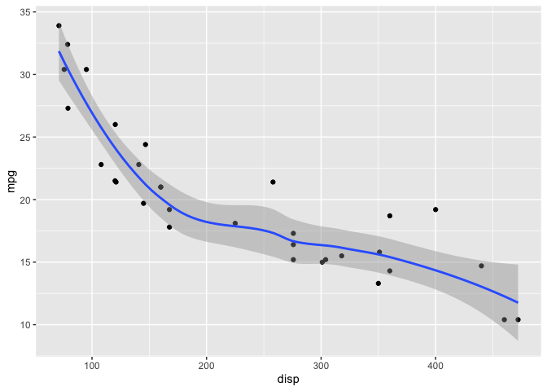
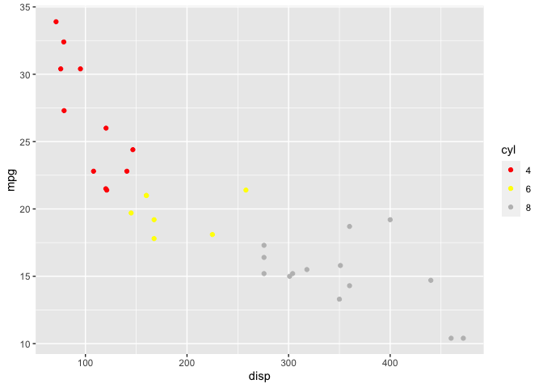
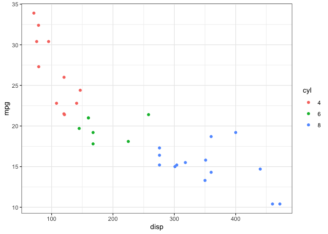
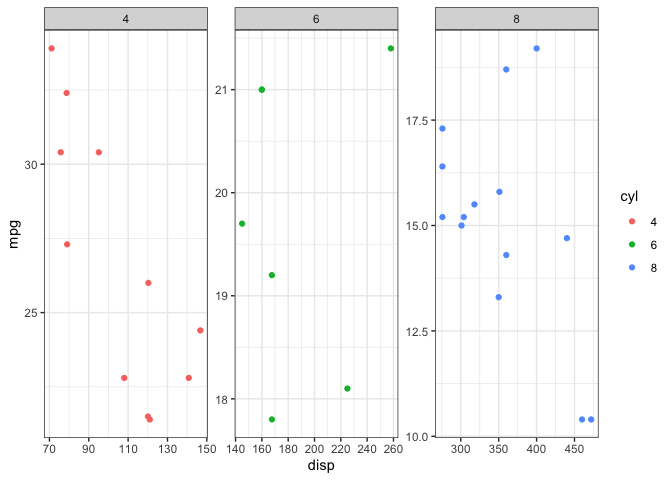
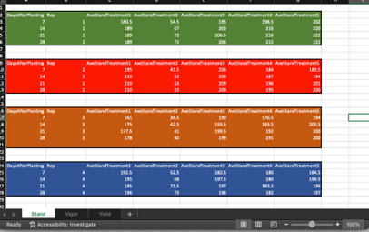

```r
library(tidyverse)
```

```
## ── Attaching packages ─────────────────────────────────────── tidyverse 1.3.2 ──
## ✔ ggplot2 3.4.1     ✔ purrr   1.0.1
## ✔ tibble  3.1.8     ✔ dplyr   1.1.0
## ✔ tidyr   1.3.0     ✔ stringr 1.5.0
## ✔ readr   2.1.4     ✔ forcats 1.0.0
## ── Conflicts ────────────────────────────────────────── tidyverse_conflicts() ──
## ✖ dplyr::filter() masks stats::filter()
## ✖ dplyr::lag()    masks stats::lag()
```


## Question 1. 

You are looking at a collaborator’s R code on github, and download the repository, and start exploring the code. The first line of the script is 

setwd(“C:/Users/…”)

-	What is the author of this code trying to do with the function setwd()?
-	Please discuss what is wrong with this approach in terms of reproducibility.
-	Where is the working directory of an R project?
-	Explain the concept of relative file paths. Is the author of this code using relative file paths? 

### Answer to Q1

Your collaborator is setting the working directory in terms of an absolute file path. Note that to set an absolute file path you starts all the way down at C:/ the root directory of the Windows hard drive. This would be reproducible on their machine, but not when I copy the R script to a directory on my own machine, since the absolute file path is not the same. An R Project solves this by letting you set relative file paths. When you open a script through an R Project, the working directory sets to the directory that the R Project is located in. You can now specify relative file paths - file paths relative to the working directory. For example, you can have a data folder containing a csv within the working directory and then just refer to read.csv("data/file.csv"). The original author may be setting the working directory (using an absolute file path) in order to then use relative file paths, but we don't know this from the prompt.


## Question 2. 

What does the acronym FAIR stand for in the context of this class? Explain how R, GitHub, and other lecture concepts introduced in this course specifically help complete FAIR data principles. 

### Answer to Q2

This stands for Findable, Accessible, Interpretable, Reusable 

Doing analyses and graphing in R makes sure that the workflow is documented (Reusable) - when compared to a point-and-click interface. If the code is well commented, this also can explain which sections of code generated individual findings (Interpretable). GitHub lets you host code and data online (Findable, Accessible). If you add a DOI to your GitHub repository, this lets you link to the code from a publication of your own and even lets other people cite your data and code directly (Findable, Accessible). Using formats such as Markdown allows people to view your code and outputs in context without even having to download your code (Accessible, Interpretable). GitHub is a backup for your code, which is valuable. Finally, if people want to access your whole repository, GitHub lets them pull a version of the repository onto their own computers so they can recreate your work (Reusable).


## Question 3. 

Explain the concept of R packages. What are R packages? Who writes R packages? What is the difference between installing and loading a package? Explain two ways to install and load packages into R. 

### Answer to Q3

Packages are collections of R functions that someone else has written, that are available to download. Anyone can write an R package, but depending on where they are hosted they probably have to comply with some standards. For example, R packages are supposed to include help files. They may also include datasets and vignettes to show you how to use the package. You usually download R packages from CRAN, a network of servers that hosts R packages. When you use install.packages() this downloads them to your computer. When you use library(), this loads the packages into memory, making all the functions available to use during an R session. You can alternatively install a package in the "Packages" pane of RStudio by pressing "Install"; once a package is installed you can load a package by pointing and clicking to check the checkbox for that package.


## Question 4. 

Explain the following concepts of ggplot and give examples of each concept using code and figures generated with ggplot using the data of your choosing.

-	Layering
-	Scales
-	Themes
-	Facets


### Answer to Q4

Layering is the idea that a plot is built up from individual layers that either render something on top of the previous layers - or modifies other layers. For example, adding geom_point() to a boxplot adds a new scatterplot layer on top of the boxplot, 


```r
df <- mtcars
df$cyl <- as.factor(df$cyl)

df %>% 
  ggplot(aes(x = disp, y = mpg)) +
  geom_point() +
  geom_smooth() # Added layer
```

```
## `geom_smooth()` using method = 'loess' and formula = 'y ~ x'
```

<!-- -->


Once you specify that the color aesthetic is mapped to (say) the number of cylinders in an engine, you can use scales to specify HOW that mapping occurs. For example, you can set the levels of colour to correspond to the levels of a categorical value as below, or you can use scale_continuous_manual() to set endpoints of colour to line up with specific values of a continuous variable.


```r
df %>% 
  ggplot(aes(x = disp, y = mpg, color = cyl)) +
  geom_point() +
  scale_discrete_manual(values = c("red", "yellow", "grey"), aesthetics = "color") # Manually added a bad choice of color
```

<!-- -->


Themes modify aspects of the plotting in general. For example, adding theme_classic() modifies the axes and plot background to be more minimalistic. Within theme() you can also set other global aspects of the plot, like font size.


```r
df %>% 
  ggplot(aes(x = disp, y = mpg, color = cyl)) +
  geom_point() +
  theme_bw()
```

<!-- -->

Facetting generates several similar graphs - just that each graph is a subset of the data. For example, if you facet by cylinder count using facet_wrap(~cyl) ggplot makes a separate subplot for each number of cylinders


```r
df %>% 
  ggplot(aes(x = disp, y = mpg, color = cyl)) +
  geom_point() +
  theme_bw() +
  facet_wrap(~cyl, scales = "free")
```

<!-- -->


## Question 5. 

Explain the differences and similarities between a vector, matrix, and dataframe. Demonstrate you know how to subset a dataframe in two ways using the built in dataset ‘ToothGrowth’ with the prompts below:  

-	Subset ToothGrowth to include rows such that supp is equal to VC
-	Subset ToothGrowth to include rows such that supp is equal to VC and dose is equal to 0.5
-	Subset ToothGrowth to include the values of len such that supp is equal to VC and dose is equal to 0.5

### Answer to Q5

A vector is  a one-dimensional set of items. Matrices and dataframes are two-dimensional sets of items (i.e., they have both rows and columns). All the items in a matrix have to be of the same class (e.g., numeric), while a dataframe can have different classes.


```r
tooth <- ToothGrowth

# Classic subsetting
tooth[tooth$supp=="VC",]
```

```
##     len supp dose
## 1   4.2   VC  0.5
## 2  11.5   VC  0.5
## 3   7.3   VC  0.5
## 4   5.8   VC  0.5
## 5   6.4   VC  0.5
## 6  10.0   VC  0.5
## 7  11.2   VC  0.5
## 8  11.2   VC  0.5
## 9   5.2   VC  0.5
## 10  7.0   VC  0.5
## 11 16.5   VC  1.0
## 12 16.5   VC  1.0
## 13 15.2   VC  1.0
## 14 17.3   VC  1.0
## 15 22.5   VC  1.0
## 16 17.3   VC  1.0
## 17 13.6   VC  1.0
## 18 14.5   VC  1.0
## 19 18.8   VC  1.0
## 20 15.5   VC  1.0
## 21 23.6   VC  2.0
## 22 18.5   VC  2.0
## 23 33.9   VC  2.0
## 24 25.5   VC  2.0
## 25 26.4   VC  2.0
## 26 32.5   VC  2.0
## 27 26.7   VC  2.0
## 28 21.5   VC  2.0
## 29 23.3   VC  2.0
## 30 29.5   VC  2.0
```

```r
tooth[tooth$supp=="VC" & tooth$dose==0.5,]
```

```
##     len supp dose
## 1   4.2   VC  0.5
## 2  11.5   VC  0.5
## 3   7.3   VC  0.5
## 4   5.8   VC  0.5
## 5   6.4   VC  0.5
## 6  10.0   VC  0.5
## 7  11.2   VC  0.5
## 8  11.2   VC  0.5
## 9   5.2   VC  0.5
## 10  7.0   VC  0.5
```

```r
tooth[tooth$supp=="VC" & tooth$dose==0.5,1]
```

```
##  [1]  4.2 11.5  7.3  5.8  6.4 10.0 11.2 11.2  5.2  7.0
```

```r
# Subsetting using dplyr verbs
tooth %>% 
  filter(supp=="VC")
```

```
##     len supp dose
## 1   4.2   VC  0.5
## 2  11.5   VC  0.5
## 3   7.3   VC  0.5
## 4   5.8   VC  0.5
## 5   6.4   VC  0.5
## 6  10.0   VC  0.5
## 7  11.2   VC  0.5
## 8  11.2   VC  0.5
## 9   5.2   VC  0.5
## 10  7.0   VC  0.5
## 11 16.5   VC  1.0
## 12 16.5   VC  1.0
## 13 15.2   VC  1.0
## 14 17.3   VC  1.0
## 15 22.5   VC  1.0
## 16 17.3   VC  1.0
## 17 13.6   VC  1.0
## 18 14.5   VC  1.0
## 19 18.8   VC  1.0
## 20 15.5   VC  1.0
## 21 23.6   VC  2.0
## 22 18.5   VC  2.0
## 23 33.9   VC  2.0
## 24 25.5   VC  2.0
## 25 26.4   VC  2.0
## 26 32.5   VC  2.0
## 27 26.7   VC  2.0
## 28 21.5   VC  2.0
## 29 23.3   VC  2.0
## 30 29.5   VC  2.0
```

```r
tooth %>% 
  filter(supp=="VC", dose==0.5)
```

```
##     len supp dose
## 1   4.2   VC  0.5
## 2  11.5   VC  0.5
## 3   7.3   VC  0.5
## 4   5.8   VC  0.5
## 5   6.4   VC  0.5
## 6  10.0   VC  0.5
## 7  11.2   VC  0.5
## 8  11.2   VC  0.5
## 9   5.2   VC  0.5
## 10  7.0   VC  0.5
```

```r
tooth %>% 
  filter(supp=="VC", dose==0.5) %>% 
  select(len)
```

```
##     len
## 1   4.2
## 2  11.5
## 3   7.3
## 4   5.8
## 5   6.4
## 6  10.0
## 7  11.2
## 8  11.2
## 9   5.2
## 10  7.0
```


## Question 6. 

Create an R markdown version of your answer to question 4 and 5. Save the .Rmd file to your computer and render it as a word document (.docx), .html, and a .md file. Push these files to your github and paste your github url here. 

### Answer to Q6

I have made this whole assignment in a version-controlled repository. These files are up my Github: https://github.com/DanAurell/ENTM6820/tree/main/Midterm_1


## Question 7. 

What is the correct order of events to get your code on github through R studio? Explain each step from creation of a repository to pushing. 

### Answer to Q7
Assuming you've already linked your RStudio to your GitHub account (a bit complicated)...

1) Create a repository ("repo") on the GitHub website.
2) Copy the web address of the GitHub repo (with .git at the end) by pressing the green "Code" button on the GitHub repo page 
3) In RStudio, make a New Project (select "Version Control" option) which checks out the project from a version control repository
  - This will "clone" the repository which means that the contents of the GitHub repo (e.g., the Readme) will be downloaded into your local folder
  - In addition, this creates an R Project in your local folder
4) Make some changes locally: For example, make a new R Markdown document
5) Then in the Git pane of RStudio, check the boxes by the file names whose changes you want to push
6) You press "commit" to somehow stage/package these changes and type in a description of the changes when prompted
7) Then you press "push" to update the GitHub repository to reflect your local changes


## Question 8. 

After you have worked on a project for a while, you mistakenly delete a file on your github, while it still exists in your local repository (on your computer). Now when you try to push your code to github the push is rejected and gives the following error, “Updates were rejected because the remote contains work that you do not have locally.” How do you solve this error?

### Answer to Q8

First, you pull from GitHub so that your local folder contains all the files on GitHub. Then you should be able to push to GitHub.

## Question 9. 

Explain the purpose of a Data Management Plan. 

### Answer to Q9

The purpose of a data management plan is to codify the process of generating, managing, using, and archiving data during a research project. This lets you think through the automated, but most importantly, the manual processes that are potentially prone to errors or concerns about the integrity of the data. Some risks include editing data and no longer having access to something you know is the original dataset; losing data through computer failure; losing access to the data through password issues or expiry of institution credentials; etc. By writing a plan you can decide how to mitigate these risks. 


## Question 10. 

A colleague gives you data in an .xlsx file that looks like this: 



Please discuss at least five things wrong with how these data are formatted that make it not reproducibility friendly. Then describe/show your colleague how the data should be formatted. 

### Answer to Q10

1) "Stand", "Vigor", and "Yield" are variables that should be in separate columns in a single worksheet

2) "Treatment" is a variable and should be a column header, with values of 1-5

3) "Rep" is a variable and should have its own column with values of 1-5 and the reps should not be separated with whitespace and new column headers between.

4) Color is unnecessary

5) You could include the raw data for "Stand" rather than the per (rep-and-treatment) average. This implies that there are also several measurements for each rep and treatment

Here is a simulated dataset that would follow [tidy data](https://r4ds.had.co.nz/tidy-data.html) principles:


```r
data.frame(
  Rep = c(rep(1, 60), rep(2, 60), rep(3, 60), rep(4, 60), rep(5, 60)),
  Treatment = rep(c(rep(1, 12),rep(2, 12),rep(3, 12),rep(4, 12),rep(5, 12)), 5),
  DaysAfterPlanting = rep(c(rep(7, 3),rep(14, 3),rep(21, 3),rep(28, 3)), 25),
  TechRep = rep(c(1:3), 100),
  Stand = rnorm(300, 200, 20),
  Vigor = runif(300, 15, 100),
  Yield = rnorm(300, 150, 15)
)
```

```
##     Rep Treatment DaysAfterPlanting TechRep    Stand    Vigor     Yield
## 1     1         1                 7       1 200.9577 15.06294 134.46654
## 2     1         1                 7       2 191.0398 63.94299 131.27811
## 3     1         1                 7       3 186.6701 48.82558 156.33794
## 4     1         1                14       1 162.9231 73.13064 150.31620
## 5     1         1                14       2 226.7105 87.02042 153.24572
## 6     1         1                14       3 167.6214 97.58505 139.22790
## 7     1         1                21       1 200.9282 95.04319 138.78347
## 8     1         1                21       2 220.3273 85.96943 156.45885
## 9     1         1                21       3 207.0817 63.85546 167.16691
## 10    1         1                28       1 223.4394 82.68297 177.23910
## 11    1         1                28       2 165.6431 50.48680 154.05890
## 12    1         1                28       3 220.4472 39.40938 139.54052
## 13    1         2                 7       1 195.8957 86.54024 147.74775
## 14    1         2                 7       2 197.5855 23.66577 119.33530
## 15    1         2                 7       3 180.8703 56.00726 152.46558
## 16    1         2                14       1 170.7784 44.24369 144.99085
## 17    1         2                14       2 213.6742 61.34501 160.54801
## 18    1         2                14       3 246.8862 42.34583 158.51697
## 19    1         2                21       1 209.1758 96.51231 167.49335
## 20    1         2                21       2 216.8547 33.66085 139.50325
## 21    1         2                21       3 215.8268 78.98378 149.68282
## 22    1         2                28       1 206.1692 18.58444 148.84883
## 23    1         2                28       2 217.6586 39.20118 144.22784
## 24    1         2                28       3 179.1448 32.40588 153.99759
## 25    1         3                 7       1 200.7964 91.02068 150.39435
## 26    1         3                 7       2 200.1050 60.28167 161.06559
## 27    1         3                 7       3 197.6009 17.22971 147.61460
## 28    1         3                14       1 226.4663 85.64893 156.60369
## 29    1         3                14       2 157.4167 96.72447 144.51974
## 30    1         3                14       3 204.0568 92.82559 141.38705
## 31    1         3                21       1 198.1420 18.66862 158.52198
## 32    1         3                21       2 221.9716 62.56297 161.88551
## 33    1         3                21       3 225.6816 91.48172 142.74080
## 34    1         3                28       1 167.1610 55.55946 163.46628
## 35    1         3                28       2 212.8824 80.33025 165.82325
## 36    1         3                28       3 188.9419 93.49776 165.14600
## 37    1         4                 7       1 208.3783 88.77817 147.37009
## 38    1         4                 7       2 202.6587 87.17999 140.18579
## 39    1         4                 7       3 187.9346 54.58913 145.01755
## 40    1         4                14       1 189.6680 85.19596 162.93472
## 41    1         4                14       2 184.5461 43.22515 183.33529
## 42    1         4                14       3 176.9600 59.15262 174.96147
## 43    1         4                21       1 241.3589 85.72066 139.28680
## 44    1         4                21       2 201.1088 65.51779 143.12451
## 45    1         4                21       3 166.2209 69.61928 157.64137
## 46    1         4                28       1 222.3519 65.89421 139.41970
## 47    1         4                28       2 216.1392 61.92421 163.28099
## 48    1         4                28       3 217.9221 78.90651 139.75181
## 49    1         5                 7       1 189.8778 28.55078 137.01955
## 50    1         5                 7       2 171.7653 63.21744 161.67855
## 51    1         5                 7       3 209.9062 61.36630 148.64168
## 52    1         5                14       1 224.2019 60.61171 177.34547
## 53    1         5                14       2 164.1540 74.31184 157.30169
## 54    1         5                14       3 182.7263 55.98761 122.64066
## 55    1         5                21       1 181.9732 44.49744 157.05377
## 56    1         5                21       2 212.8667 26.74311 138.07974
## 57    1         5                21       3 183.7695 86.92711 149.68343
## 58    1         5                28       1 200.3847 59.95405 150.93674
## 59    1         5                28       2 159.5220 75.02662 152.94848
## 60    1         5                28       3 205.1024 35.39329 139.68854
## 61    2         1                 7       1 212.3780 15.49666 163.49869
## 62    2         1                 7       2 177.9892 29.17493 162.45235
## 63    2         1                 7       3 196.6983 48.47930 142.52981
## 64    2         1                14       1 225.4676 56.42830 175.65526
## 65    2         1                14       2 199.2507 86.62147 143.71922
## 66    2         1                14       3 181.8495 31.63228 175.30058
## 67    2         1                21       1 229.0092 49.52814 168.64489
## 68    2         1                21       2 210.8398 62.71811 160.36365
## 69    2         1                21       3 205.6596 57.75238 129.96335
## 70    2         1                28       1 211.1661 36.62072 139.87889
## 71    2         1                28       2 181.5223 61.26568 163.55612
## 72    2         1                28       3 187.0772 30.14416 150.03229
## 73    2         2                 7       1 223.5632 83.25531 164.74981
## 74    2         2                 7       2 221.2887 86.31339 154.67552
## 75    2         2                 7       3 207.3418 88.13020 171.67264
## 76    2         2                14       1 225.0594 16.68934 138.75366
## 77    2         2                14       2 218.5354 83.23612 144.54506
## 78    2         2                14       3 199.6771 73.50378 166.08378
## 79    2         2                21       1 165.3953 22.61020 123.40799
## 80    2         2                21       2 184.8932 68.55014 155.76271
## 81    2         2                21       3 186.9792 45.12547 147.64305
## 82    2         2                28       1 177.6951 59.83439 133.27314
## 83    2         2                28       2 210.5167 99.91954 151.95322
## 84    2         2                28       3 200.1523 18.94601 154.56962
## 85    2         3                 7       1 212.7439 57.44395 142.94948
## 86    2         3                 7       2 186.9480 78.40530 128.96101
## 87    2         3                 7       3 229.9185 92.15555 138.69856
## 88    2         3                14       1 180.6811 93.39848 172.01889
## 89    2         3                14       2 184.7791 98.72849 175.48412
## 90    2         3                14       3 225.1219 36.44090 139.74231
## 91    2         3                21       1 168.1850 95.30502 159.52306
## 92    2         3                21       2 182.8954 33.01072 163.31238
## 93    2         3                21       3 191.6840 61.03103 123.37062
## 94    2         3                28       1 183.9386 48.10704 138.85673
## 95    2         3                28       2 191.9000 97.55820 144.12132
## 96    2         3                28       3 199.7445 96.17664 157.31528
## 97    2         4                 7       1 191.0255 83.07079 166.61843
## 98    2         4                 7       2 203.5025 28.10226 115.07575
## 99    2         4                 7       3 217.3124 98.99240 176.44563
## 100   2         4                14       1 189.6498 29.88360 171.31785
## 101   2         4                14       2 194.4360 81.93644 126.33760
## 102   2         4                14       3 159.1976 94.09077 151.39104
## 103   2         4                21       1 163.1354 20.01505 144.16103
## 104   2         4                21       2 175.5796 54.93087 150.38319
## 105   2         4                21       3 211.0625 94.82589 132.47961
## 106   2         4                28       1 175.2208 65.48705 144.71206
## 107   2         4                28       2 210.4597 28.87661 151.30031
## 108   2         4                28       3 183.3434 32.99573 129.98537
## 109   2         5                 7       1 203.8007 29.97846 139.76680
## 110   2         5                 7       2 184.4156 36.68740 124.01457
## 111   2         5                 7       3 162.3582 98.96049 153.39700
## 112   2         5                14       1 222.8967 52.82636 157.22093
## 113   2         5                14       2 186.6277 26.12584 136.20616
## 114   2         5                14       3 201.2647 24.12238 137.84015
## 115   2         5                21       1 204.4178 80.72480 152.20730
## 116   2         5                21       2 209.4259 87.21977 154.95732
## 117   2         5                21       3 204.5089 22.23109 136.04879
## 118   2         5                28       1 211.4814 27.46290 160.96460
## 119   2         5                28       2 219.8021 46.79862 139.07990
## 120   2         5                28       3 214.2412 64.69991 142.95677
## 121   3         1                 7       1 191.8677 75.57867 160.58207
## 122   3         1                 7       2 200.1808 20.81307 168.29297
## 123   3         1                 7       3 211.6833 62.56097 146.04346
## 124   3         1                14       1 182.8501 37.79085 136.89108
## 125   3         1                14       2 204.8378 35.19212 146.92152
## 126   3         1                14       3 220.4461 63.52659 156.32629
## 127   3         1                21       1 195.6841 96.16610 154.54563
## 128   3         1                21       2 220.1435 64.52799 193.56448
## 129   3         1                21       3 190.4532 15.35277 167.45558
## 130   3         1                28       1 209.1761 53.92554 194.64175
## 131   3         1                28       2 163.6895 22.22900 176.08046
## 132   3         1                28       3 191.2585 73.27979 154.42615
## 133   3         2                 7       1 184.4656 45.81786 160.11279
## 134   3         2                 7       2 189.4072 25.26252 149.21157
## 135   3         2                 7       3 215.3045 55.35374 150.62546
## 136   3         2                14       1 187.8132 88.03443 160.03599
## 137   3         2                14       2 198.1804 66.32097 141.68014
## 138   3         2                14       3 207.8276 38.77616 166.72097
## 139   3         2                21       1 223.8875 27.52514 153.26070
## 140   3         2                21       2 203.2384 24.96783 121.50539
## 141   3         2                21       3 181.5421 30.67510 149.54643
## 142   3         2                28       1 240.8198 91.75390 169.77007
## 143   3         2                28       2 233.2736 37.46791 160.67381
## 144   3         2                28       3 231.4194 60.07311 169.02752
## 145   3         3                 7       1 206.7372 90.71062 162.62261
## 146   3         3                 7       2 148.5465 50.34871 158.37915
## 147   3         3                 7       3 216.4193 57.30000 171.85727
## 148   3         3                14       1 164.4606 80.00697 147.45872
## 149   3         3                14       2 191.2333 54.29952 176.66345
## 150   3         3                14       3 203.6008 57.22282 138.80811
## 151   3         3                21       1 188.3475 82.48747 134.45881
## 152   3         3                21       2 181.1473 61.70980 140.76355
## 153   3         3                21       3 209.1696 92.69755 171.75361
## 154   3         3                28       1 207.0912 82.83750 130.96578
## 155   3         3                28       2 200.7325 50.08512 158.43663
## 156   3         3                28       3 192.8133 40.68450 142.29925
## 157   3         4                 7       1 174.7311 26.29156 133.80396
## 158   3         4                 7       2 160.1138 61.62435 139.76234
## 159   3         4                 7       3 200.4051 54.50987 141.01598
## 160   3         4                14       1 225.1414 18.51525 167.45031
## 161   3         4                14       2 197.7465 16.68032 159.03346
## 162   3         4                14       3 183.8892 70.33453 150.16991
## 163   3         4                21       1 194.8091 22.37067 159.80908
## 164   3         4                21       2 190.5749 27.15059 180.62015
## 165   3         4                21       3 208.4775 79.93929 121.75736
## 166   3         4                28       1 189.4573 80.68285 124.21487
## 167   3         4                28       2 222.1368 97.79049 154.77011
## 168   3         4                28       3 215.8807 96.87086 149.18964
## 169   3         5                 7       1 229.9822 96.24563 142.23070
## 170   3         5                 7       2 189.1487 62.61145 140.83605
## 171   3         5                 7       3 248.4228 37.92636 162.40612
## 172   3         5                14       1 231.4261 96.50569 144.60679
## 173   3         5                14       2 202.3442 59.56279 145.08022
## 174   3         5                14       3 183.2354 88.15070 154.88319
## 175   3         5                21       1 218.4521 72.13048 159.58648
## 176   3         5                21       2 188.4636 69.68033 172.39187
## 177   3         5                21       3 173.8093 98.90795 140.44701
## 178   3         5                28       1 212.6414 36.15047 164.03741
## 179   3         5                28       2 255.5818 96.13651 150.74208
## 180   3         5                28       3 197.4238 56.84082 171.62571
## 181   4         1                 7       1 200.7920 81.95426 159.27170
## 182   4         1                 7       2 202.3061 42.12362 166.30349
## 183   4         1                 7       3 182.2062 27.78792 141.72026
## 184   4         1                14       1 216.8574 78.65518 149.16185
## 185   4         1                14       2 191.6448 41.19562 139.95332
## 186   4         1                14       3 152.0626 91.89157 178.92242
## 187   4         1                21       1 178.1165 28.62398 170.38854
## 188   4         1                21       2 161.9346 64.47349 183.97624
## 189   4         1                21       3 214.6060 19.36225 158.24257
## 190   4         1                28       1 191.2312 94.81391 138.75096
## 191   4         1                28       2 198.8634 46.23556 136.49138
## 192   4         1                28       3 196.9779 25.17954 164.42002
## 193   4         2                 7       1 211.1239 69.59058 173.36537
## 194   4         2                 7       2 188.0020 85.78659 150.74813
## 195   4         2                 7       3 180.0730 53.20409 144.90524
## 196   4         2                14       1 224.4471 59.15133 155.68573
## 197   4         2                14       2 174.2379 60.29904 131.60355
## 198   4         2                14       3 202.3003 22.51308 136.36858
## 199   4         2                21       1 182.6629 78.13213 126.76653
## 200   4         2                21       2 210.6940 18.73557 157.08240
## 201   4         2                21       3 214.6886 33.05168 141.33662
## 202   4         2                28       1 183.1520 26.90835 131.95659
## 203   4         2                28       2 194.6287 70.04141 154.41489
## 204   4         2                28       3 200.2504 73.71288 137.93829
## 205   4         3                 7       1 198.5788 73.83835 152.93189
## 206   4         3                 7       2 196.5742 89.24353 168.11162
## 207   4         3                 7       3 178.0810 91.50601 160.94922
## 208   4         3                14       1 194.4686 53.02390 150.43518
## 209   4         3                14       2 207.7927 81.44436 161.60923
## 210   4         3                14       3 175.0216 54.91411 171.81967
## 211   4         3                21       1 194.4947 57.33519 132.69957
## 212   4         3                21       2 177.0545 85.61929 145.09725
## 213   4         3                21       3 166.1904 44.65235 141.25809
## 214   4         3                28       1 169.6405 87.82803 138.87688
## 215   4         3                28       2 225.9561 29.88924 151.00194
## 216   4         3                28       3 210.0130 82.75049 167.44163
## 217   4         4                 7       1 221.7374 96.05089 167.75490
## 218   4         4                 7       2 182.2330 23.63020 142.47191
## 219   4         4                 7       3 201.1974 69.18444 178.99873
## 220   4         4                14       1 186.2951 55.97040 130.74405
## 221   4         4                14       2 192.6954 92.73726 135.48184
## 222   4         4                14       3 182.2520 60.34368 139.57275
## 223   4         4                21       1 170.7417 42.47928 152.86151
## 224   4         4                21       2 218.6310 18.70342 131.00298
## 225   4         4                21       3 145.9600 24.75343 139.19561
## 226   4         4                28       1 226.1064 63.11272 183.87019
## 227   4         4                28       2 183.3366 72.35963 119.96722
## 228   4         4                28       3 217.9323 16.13068 165.77328
## 229   4         5                 7       1 208.8072 28.76952 156.06875
## 230   4         5                 7       2 233.7426 62.65960 138.73561
## 231   4         5                 7       3 197.2570 45.97057 140.16509
## 232   4         5                14       1 205.3158 86.66875 137.98211
## 233   4         5                14       2 220.6758 24.31366 166.66865
## 234   4         5                14       3 202.1258 96.19500 167.34707
## 235   4         5                21       1 191.5866 20.29319 167.48025
## 236   4         5                21       2 175.2771 31.26769 175.41344
## 237   4         5                21       3 230.7509 61.23064 158.79109
## 238   4         5                28       1 162.9413 81.51828 139.36805
## 239   4         5                28       2 205.2610 42.23815 157.18394
## 240   4         5                28       3 196.8272 44.86543 150.88758
## 241   5         1                 7       1 213.8518 22.13711 121.89357
## 242   5         1                 7       2 174.7957 56.91880 134.69118
## 243   5         1                 7       3 223.7207 74.30138 153.17050
## 244   5         1                14       1 199.6730 67.34700 144.38174
## 245   5         1                14       2 177.6049 84.66778 146.31099
## 246   5         1                14       3 179.3882 25.57494 172.98934
## 247   5         1                21       1 196.8068 28.00394 173.46164
## 248   5         1                21       2 149.0556 61.46717 146.95389
## 249   5         1                21       3 211.2677 61.55929 156.73351
## 250   5         1                28       1 204.9849 48.85058 145.51964
## 251   5         1                28       2 223.7619 90.18481 133.67474
## 252   5         1                28       3 171.7860 43.53250 136.94761
## 253   5         2                 7       1 203.7871 49.22432 195.08146
## 254   5         2                 7       2 170.0547 98.84829 155.71878
## 255   5         2                 7       3 205.4171 65.60691 144.92412
## 256   5         2                14       1 191.7413 51.90589 146.42870
## 257   5         2                14       2 225.6435 94.02554 164.93401
## 258   5         2                14       3 226.5179 45.24911 156.72587
## 259   5         2                21       1 199.5222 31.77495 164.38198
## 260   5         2                21       2 213.7285 29.66432 154.35412
## 261   5         2                21       3 188.7355 47.63419 125.21352
## 262   5         2                28       1 209.0516 60.21852 128.90824
## 263   5         2                28       2 175.1639 69.06340 154.97501
## 264   5         2                28       3 199.5174 97.50786 141.06327
## 265   5         3                 7       1 182.9319 38.03064 146.06112
## 266   5         3                 7       2 192.1065 97.34973 151.26167
## 267   5         3                 7       3 231.5844 66.86577 152.29667
## 268   5         3                14       1 216.8496 19.91879 159.48446
## 269   5         3                14       2 191.8143 80.70144 153.67023
## 270   5         3                14       3 196.2582 71.10405 160.91069
## 271   5         3                21       1 173.8973 21.93232 143.91001
## 272   5         3                21       2 204.5469 61.27273 112.02714
## 273   5         3                21       3 226.5866 75.01987 168.59832
## 274   5         3                28       1 209.6490 17.00173 139.17104
## 275   5         3                28       2 207.3486 45.85498 144.97357
## 276   5         3                28       3 197.7677 93.28557 140.50395
## 277   5         4                 7       1 186.3156 40.50279 145.52065
## 278   5         4                 7       2 199.9246 61.34599 142.06697
## 279   5         4                 7       3 198.2030 43.91634 195.55827
## 280   5         4                14       1 195.3958 35.89902 133.63639
## 281   5         4                14       2 221.3800 36.66707 147.91522
## 282   5         4                14       3 206.1660 73.00741 161.26113
## 283   5         4                21       1 221.6461 24.58524 154.76231
## 284   5         4                21       2 166.7082 22.31036 162.93039
## 285   5         4                21       3 184.9553 64.38359 153.00428
## 286   5         4                28       1 188.2732 29.03670 149.08377
## 287   5         4                28       2 195.0137 82.07492 156.89606
## 288   5         4                28       3 184.7577 17.69614 149.10083
## 289   5         5                 7       1 178.2938 92.51445  98.74117
## 290   5         5                 7       2 205.1779 67.98107 140.17752
## 291   5         5                 7       3 142.8680 76.68492 142.83712
## 292   5         5                14       1 147.9562 35.77782 148.22714
## 293   5         5                14       2 174.8517 77.23573 149.51400
## 294   5         5                14       3 220.8489 63.31401 159.15690
## 295   5         5                21       1 179.3713 65.12160 159.60447
## 296   5         5                21       2 224.1458 45.17925 144.09601
## 297   5         5                21       3 222.5077 26.15193 159.46970
## 298   5         5                28       1 200.8976 24.68573 167.44515
## 299   5         5                28       2 241.0383 68.48046 138.30330
## 300   5         5                28       3 182.4315 33.37814 144.10382
```


