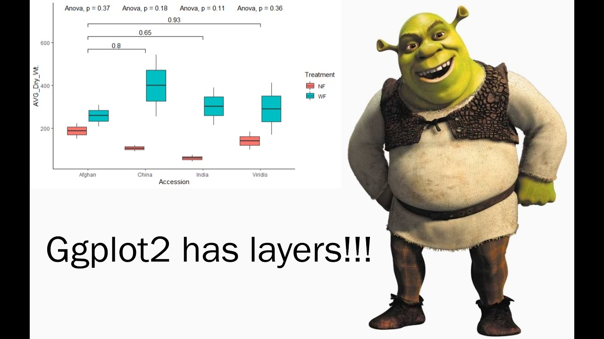

## YAML headers
Say we want to save a .Md file (the in between RMd and HTML)
- Then we edit the output up top
- Because we want to push the .Md file up to GitHub

can also have output: github_document

Can include "word_document: default" but it wasn't outputting a Word doc for me


Make a plot
```{r}
plot(x=cars$dist, y=cars$speed)
```


*italics* or _italics_

**bold**

> emphasized
emphasized

> We hold these thruths to be
> self-evident

> emphasized

> emphasized

```{r}
x = 2
```


This calls r code inline, for example three times x equals `r 3*x`.

#### Unordered lists
* one item
* two
* three
  * one more

#### Ordered lists
  
  
1. The first item
2. Second
    * Second subitem
    - Subitem


[This is a hyperlink](https://github.com)

https://github.com


Can include images and tables... will pick back up on Tuesday.




